# Consuming Graph API in ASP.NET Web API Application as App-Only Mode #

Unlike the ASP.NET MVC app introduced in another [article](https://graph.microsoft.io/docs/platform/aspnetmvc), there are requirements that apps should communicate with Graph API without requiring users to authenticate their credentials.

In this article, we are going to look at the minimum tasks required to connect your application to Office 365 and call the Microsoft Graph API. This topic won't create an app from scratch. Instead, we are going to use code from [Graph API App-Only Web API Sample](https://github.com/devkimchi/Graph-API-App-Only-Web-API-Sample) to explain the main concepts that you have to implement in your app.

> **NOTE**: The sample code uses ASP.NET 5 and ASP.NET MVC 6.


## Overview ##

In order to run this sample app to call Graph API, the following tasks **MUST** be completed:

* Create and register an application in Azure Active Directory (AAD).
* Trust IIS or IIS Express with a self-signed certificate.
* Get access token from AAD using Azure AD Authentication Library for .NET (ADAL) by providing client Id and client secret key.
* Call Graph API with access token.


## Create and Register an Application in Azure Active Directory (AAD) ##

Before we start running the sample app, we need to register the app and set permissions to consume Graph API services. Please read the following instruction carefully.


### Step 1 &ndash; Register Application to AAD ###

* Login to [Azure Management Portal](https://manage.windowsazure.com).
* Select Active Directory.

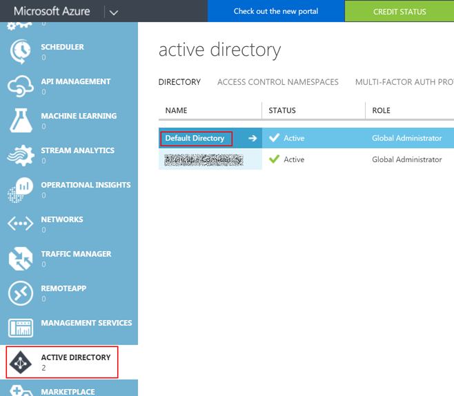

* Add a new application.

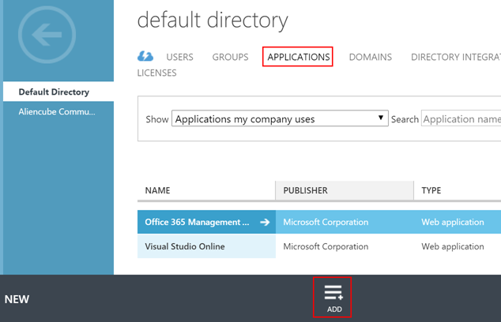

* Choose the `Add an application my organization is developing` option.

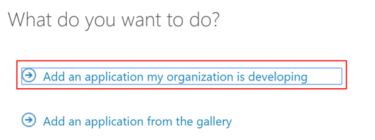

* Enter the application name like `Graph API App-only Sample` and select the `Web Application and/or Web API` option. 

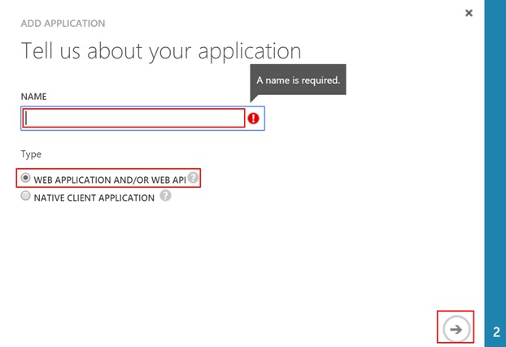

* Enter `https://[tenant-name]/GraphApiAppOnlySample` for both fields. `[tenant-name]` should look like `contoso.onmicrosoft.com`. Please note that both won't be used at all.

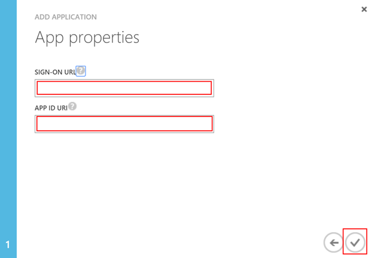

Now the app has been registered.


### Step 2 &ndash; Configure Application ###

* Once the app is created, click the `configure` tab.

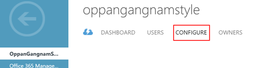

* Get the `Client ID`.

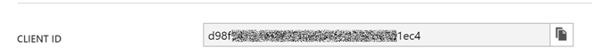

* Get the secret key. Note that the key is only displayed once after click the `Save` button at the bottom.

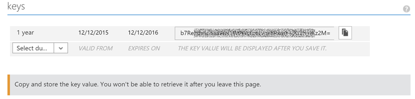

* Give AAD all delegated permissions of 8.

> Make sure that, in the production app, appropriate number of delegated permissions **MUST** be given to avoid any security breach.

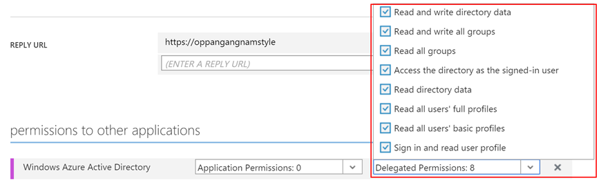

* Add another application called `Microsoft Graph`

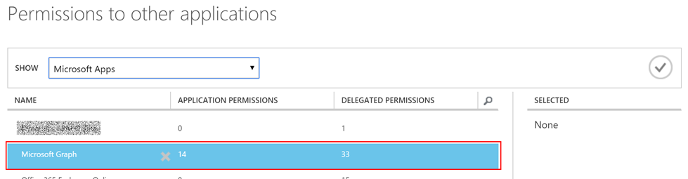

* Give `Microsoft Graph` all application permissions of 14 and delegated permissions of 33.

> Make sure that, in the production app, appropriate number of application permissions and delegated permissions **MUST** be given to avoid any security breach.

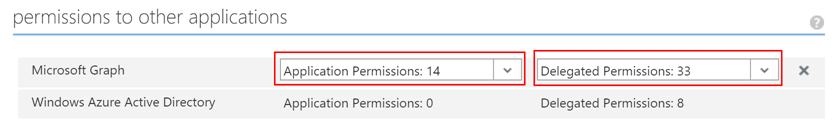

The app has now been configured.


### Step 3 &ndash; Update Settings in Sample Application ###

As the app has been registered and configured, the sample Web API app should be setup with appropriate settings. Firstly, open `appsettings.json`

```
{
  ...
  "GraphApp": {
    "Tenant": "contoso.onmicrosoft.com",
    "AuthUrl": "https://login.microsoftonline.com/{0}",
    "GraphUrl": "https://graph.microsoft.com",
    "Version": "v1.0",
    "ClientId": "client-id-value",
    "ClientSecret": "client-secret-key-value",
    "AppId": "https://contoso.onmicrosoft.com/GraphApiAppOnlySample"
  }
}
```

Then change values:

* `Tenant`: `contoso.onmicrosoft.com` to your tenant name.
* `ClientId`: Client ID from the app.
* `SlientSecret`: Secret key from the app.
* `AppId`: `contoso.onmicrosoft.com` to your tenant name.


## Trust IIS or IIS Express with a Self-signed Certificate ##

> You can skip this setp, if you already have a self-signed certificate on your root certificate storage.

All communications with AAD and Graph API are performed through a secure channel (SSL/TLS), this sample app **MUST** be signed with a root certificate. However, this is a developer's local environment, so a self-signed certificate should be issued and stored as a root certificate. The following steps show how to register self-signed certificate to the root certificate store using PowerShell.


### Step 1 &ndash; Check Self-signed Certificate ###

First, Check if you have a self-signed certificate in your personal certificate store.

```
PS C:\WINDOWS\system32> dir Cert:\LocalMachine\My


    Directory: Microsoft.PowerShell.Security\Certificate::LocalMachine\My


Thumbprint                                Subject                                               
----------                                -------                                               
EBD8********************************6E42  CN=localhost
```

If there's no certificate with name of `CN=localhost`, you should create the one using `makecert.exe`. The easiest way to execute `makecert.exe` is to run `Developer Command Prompt for VS2015`.

```
makecert.exe -r -pe -n "CN=localhost" -b 01/01/2015 -e 12/31/2020 -ss My -len 2048
``` 

* `-r`: Create a self signed certificate.
* `-pe`: Mark generated private key as exportable.
* `-n`: Certificate subject X509 name. eg) `-n "CN=localhost"`
* `-b`: Start of the validity period in `mm/dd/yyyy` format; default to now.
* `-e`: End of validity period in `mm/dd/yyyy` format; defaults to 2039.
* `-ss`: Subject's certificate store name that stores the output certificate. eg) `-ss My`
* `-len`: Generated Key Length (Bits). Default to `2048` for 'RSA' and `512` for 'DSS'.


### Step 2 &ndash; Store Self-signed Certificate to Root Store ###

Second, store the self-signed certificate to the root store.

```
PS C:\WINDOWS\system32> $cert = (Get-Item Cert:\LocalMachine\My\EBD8********************************6E42)
PS C:\WINDOWS\system32> $store = (Get-Item Cert:\Localmachine\Root)
PS C:\WINDOWS\system32> $flags = [System.Security.Cryptography.X509Certificates.OpenFlags]::ReadWrite
PS C:\WINDOWS\system32> $store.Open($flags)
PS C:\WINDOWS\system32> $store.Add($cert)
PS C:\WINDOWS\system32> $store.Close()
```

Finally, you can verify the self-signed certificate has been stored into the root store.

```
PS C:\WINDOWS\system32> dir Cert:\LocalMachine\Root


    Directory: Microsoft.PowerShell.Security\Certificate::LocalMachine\Root


Thumbprint                                Subject                                               
----------                                -------                                               
...
EBD8********************************6E42  CN=localhost 
...
```

## Get Access Token from AAD Using ADAL ##

In order to get an access token from AAD, we need to setup `AuthenticationContext` instance and call a method to get one. The code snippet below is an extract from the sample applicaton.

```csharp
public class OrganisationController : Controller
{
  ...

  public OrganisationController(IOptions<GraphApp> graphApp)
  {
    this._graphApp = graphApp.Value;
    this.Init();
  }

  ...
  
  private void Init()
  {
    var tenant = this._graphApp.Tenant;
    var authUrl = this._graphApp.AuthUrl;
    var authority = string.Format(authUrl, tenant);
  
    this._authContext = new AuthenticationContext(authority);
  
    var clientId = this._graphApp.ClientId;
    var clientSecret = this._graphApp.ClientSecret;
  
    this._credential = new ClientCredential(clientId, clientSecret);
  
    this._graphUrl = this._graphApp.GraphUrl;
    this._version = this._graphApp.Version;
  }
}
```

The `graphApp` instance is created from `appsettings.json` and injected to the controller. With this instance, both `AuthenticationContext` instance and `ClientCredential` instance have been created. Note that the `ClientCredential` instance only uses `clientId` and `clientSecret`, not user credentials. In other words, this sample application won't require any user to login and provide their login details. Let's see the actual `Get()` method.

```csharp
[HttpGet]
public async Task<IActionResult> Get()
{
  AuthenticationResult authResult;
  try
  {
    authResult = await this._authContext.AcquireTokenAsync(this._graphUrl, this._credential);
  }
  catch (Exception ex)
  {
    var result = new JsonResult(ex);
    return result;
  }

  ...
}
```

This is the part to get access token. The `AuthenticationContext` instance sends a request for Graph API with the `ClientCredential` instance only containing `clientId` and `clientSecret`. When the authentication fails, the `Get()` action will return the exception details as a JSON format. The `authResult` instance now contains access token.


## Call Graph API with Access Token ##

Now, we have the access token. In the same action method, let's see how it is consumed to call Graph API.

```csharp
[HttpGet]
public async Task<IActionResult> Get()
{
  ...

  try
  {
    using (var client = new HttpClient())
    {
      client.DefaultRequestHeaders.Authorization = new AuthenticationHeaderValue("Bearer", authResult.AccessToken);
      client.DefaultRequestHeaders.Accept.Add(new MediaTypeWithQualityHeaderValue("application/json"));
      var url = $"{this._graphUrl}/{this._version}/{Organisation}";

      var resultAsString = await client.GetStringAsync(url);

      var organisation = JObject.Parse(resultAsString);
      var result = new JsonResult(organisation);
      return result;
    }
  }
  catch (Exception ex)
  {
    var result = new JsonResult(ex);
    return result;
  }
}
```

The access token is set to the request header. In this sample code, we call `organization` details through Graph API.


That's it. If you use [Fiddler](http://www.telerik.com/fiddler), send a request to the application and you will see the full response details.


## Next Steps ##

We only have a look at the `/organization` endpoint. There are many other resource endpoints as well. So, if you like, try to change any endpoint instead of `/organization`. The full reference can be found [here](https://graph.microsoft.io/docs/api-reference/v1.0). If you want to try another sample code, please visit [GitHub](https://github.com/OfficeDev?utf8=%E2%9C%93&query=-asp) repositories.